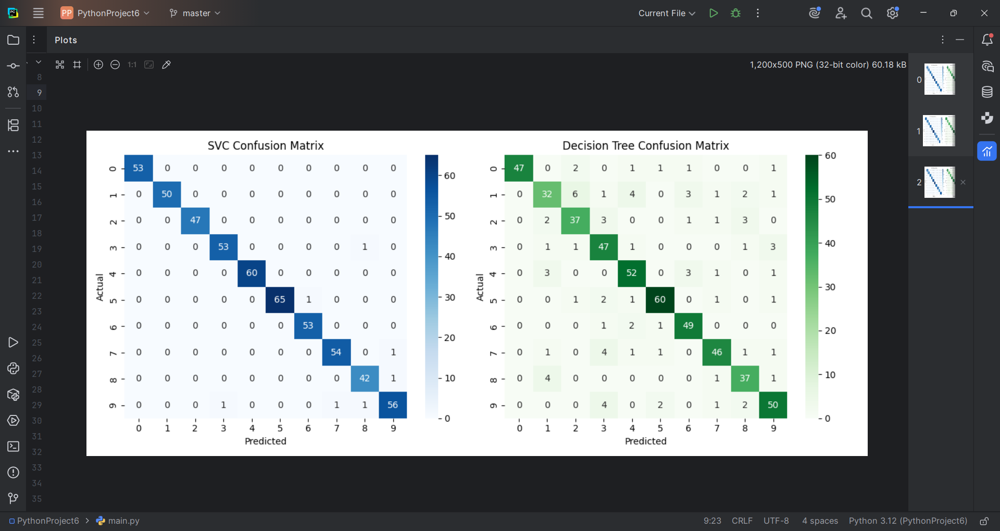

~~# Digits Classifier Comparison 📊🧠

This project is part of my training at **IT Gates Academy**. It compares the performance of two classic machine learning models:

- **Support Vector Machine (SVM)**
- **Decision Tree Classifier**

using the **Digits** dataset from Scikit-learn.

---

## 🔧 Technologies Used

- Python
- scikit-learn
- matplotlib
- seaborn

---

## 📁 Project Structure

- `main.py` → contains the full code to train and test both models
- `result.txt` → saves accuracy & classification reports
- `README.md` → explains the project

---

## 📊 What This Project Does

- Loads the handwritten digits dataset
- Splits it into training and test sets
- Trains two models (SVC and Decision Tree)
- Compares them using:
  - Accuracy score
  - Classification report
  - Confusion matrix (with heatmaps)
- Saves all results to `result.txt`

---

## ✅ Results

- You will see accuracy printed in the terminal
- The classification report includes precision, recall, and F1-score
- Confusion matrices are displayed using Seaborn heatmaps

---

## Sample Output

This is the confusion matrix generated by the models:

---~~

## 💡 Future Ideas

- Try more models (like RandomForest, KNN)
- Add cross-validation
- Build a simple GUI for inputting digits

---

## 🔗 Connect With Me

- **Name**: Youssef Fahem Amin Hasson  
- **Email**: yousef.fahem11@gmail.com  
- **GitHub**: [github.com/youseffahem](https://github.com/youseffahem)  
- **LinkedIn**: [linkedin.com/in/yousef-fahem0](https://www.linkedin.com/in/yousef-fahem0)

---

> 🚀 Proudly built as part of my learning journey in AI & ML!
